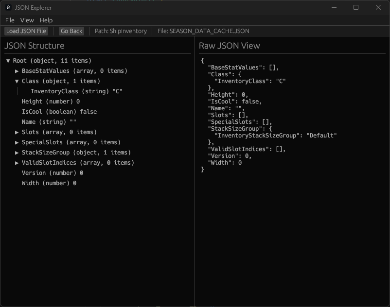

# JSON Explorer

JSON Explorer is a simple application written in Rust (with egui) to explore
arbitrary JSON documents via a simple tree-node system. It is very simple
currently, really just to explore some ideas and tinker with egui.

## Building & Running

Be sure to have Rust installed per your system's guidance, then you should
be able to simply run `cargo run --release` to build and run the app.

## Screenshots

